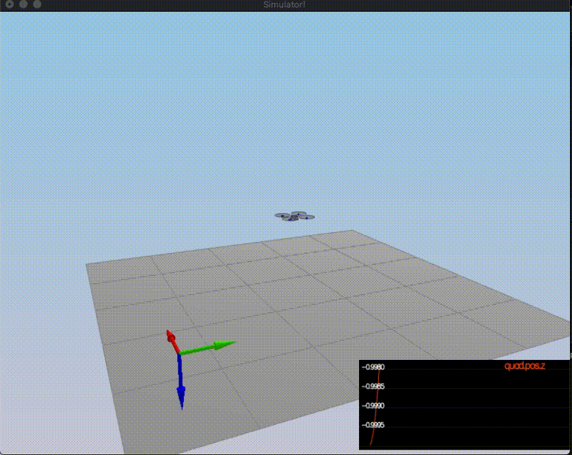
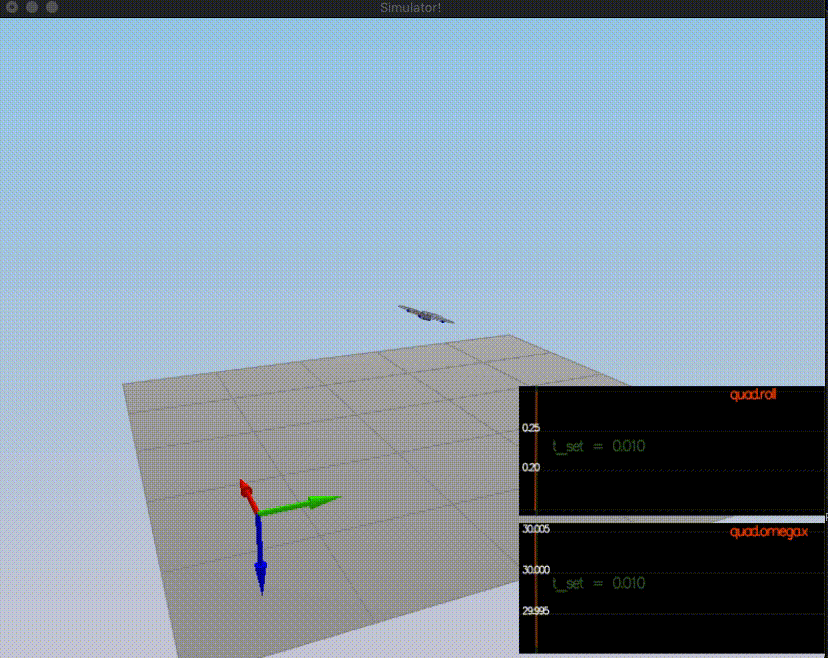
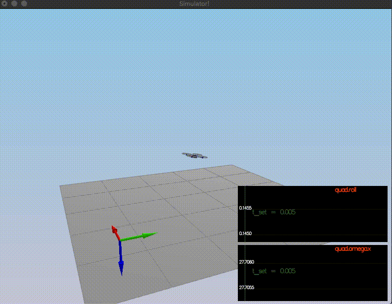
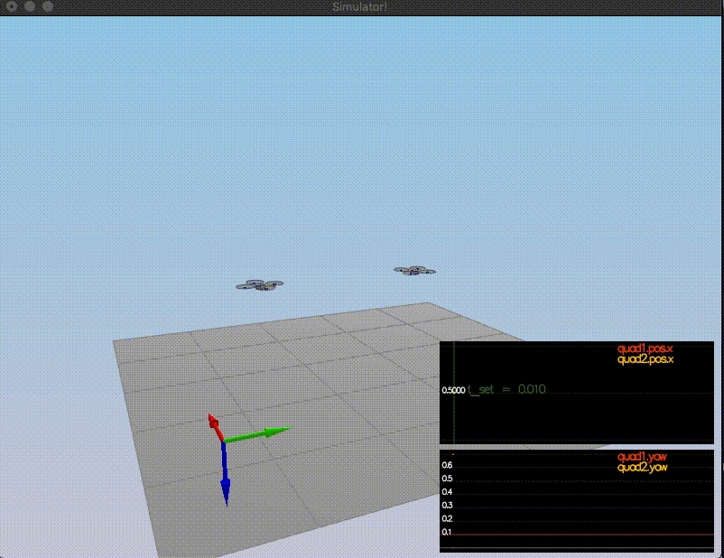
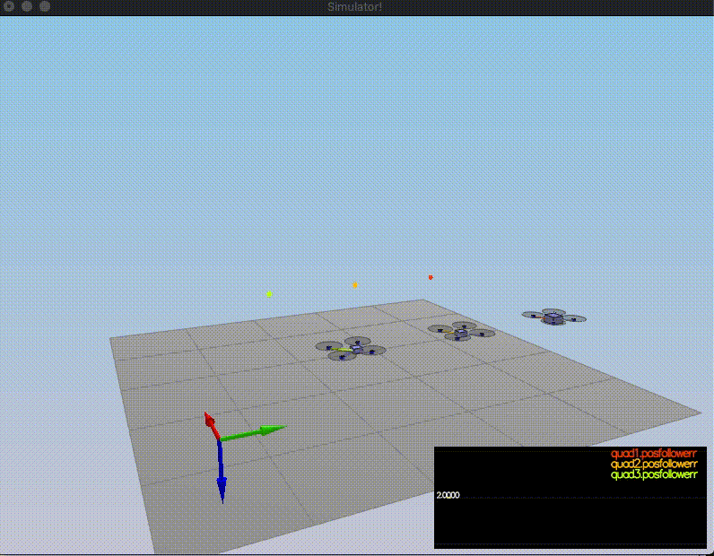
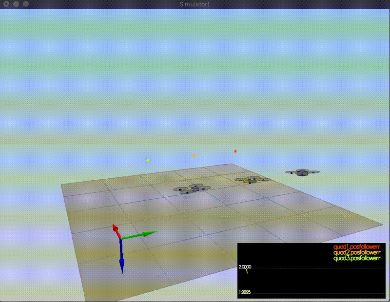
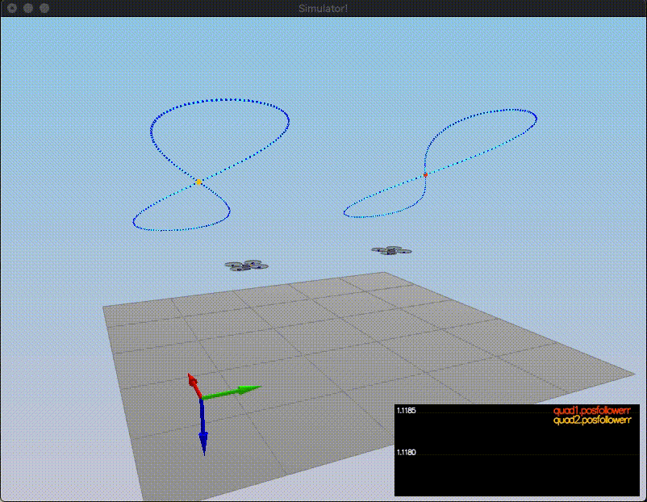
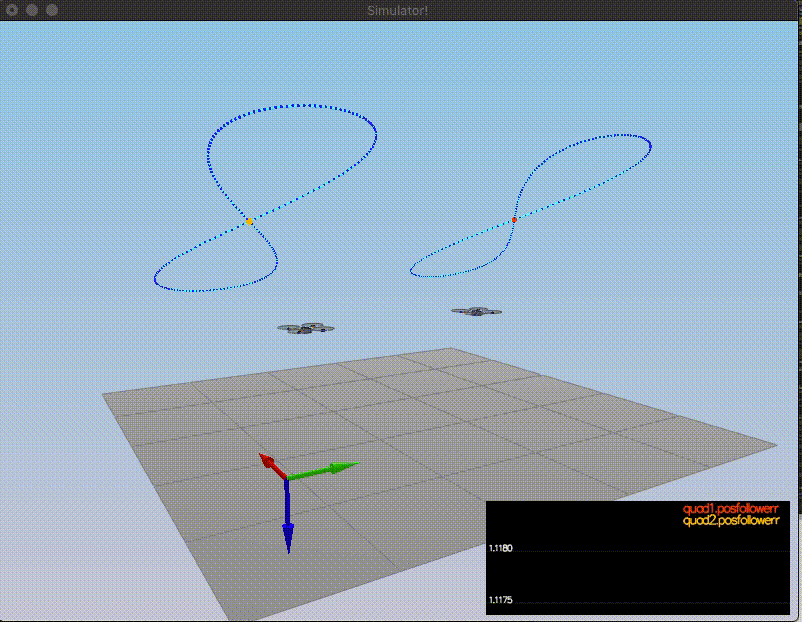

# The C++ PID Controller Project Readme #

## Overview ##

This is the readme for the completed C++ simulation project on controlling a quadcopter using a PID (proportional integral derivative) controller. This controller is ideal for a real world quadcopter or flying car as it continously calculates the error between the expected (ideal) measurement and the actual measurements.

The correct code is located in [cimoody/FCND-Controls-CPP/src/QuadControl.cpp](https://github.com/cimoody/FCND-Controls-CPP/blob/master/src/QuadControl.cpp) and was written using MacOS 10.14.2 and Xcode version 10.1 (10B61). Framework for PID controllers and parameters was provided in documentation given by [S. Lupashin from Fotokite](https://github.com/cimoody/FCND-Controls-CPP/blob/master/Double_Integrator_Control__Cascaded_P_Controller_Gains_vs_Damping_Ratio.pdf) on the ratio of the inner and outer gains for a cascaded proportional controller, and by [A. Schoelligg et al](https://github.com/cimoody/FCND-Controls-CPP/blob/master/schoellig-acc12.pdf) on feed foward parameter identification in PID controllers. Parameters for the PID controller were tuned using trail and error based on the 5 scenarios presented in the instructional [README](https://github.com/cimoody/FCND-Controls-CPP/blob/master/Cpp_README.md) and explained below.

To demonstrate the correct implementation of the C++ PID controls, sample videos of the simulator performing the 5 specific tasks ([listed in Cpp_README.md, starting with the mass tuning](https://github.com/cimoody/FCND-Controls-CPP/blob/master/Cpp_README.md#testing-it-out)) are included in this write-up.

## The Tasks ##
### The 5 tasks are:
1. Hovering at correct mass 

2. Stopping an initially spinning quadcopter or drone by correctly implementing the functions controlling individual motor thrust and rotational rates in
	- `GenerateMotorCommands()`
	- `BodyRateControl()`
	and tuning the proportional parameter for the rotational velocities
	- `kpPQR` in 'QuadControlParams.txt'.

3. Controlling the yaw (clockwise/counter-clockwise rotation), altitude, and lateral position controls of two drones by impelementing the propotional derative 
	- `AltitudeControl()` function,
	- `LateralPositionControl()` function,
	- `YawControl()` function,
	and tuning the related proportional and derivative constants
	- `kpPosZ`, `kpVelZ`, `kpPosXY`, `kpVelXY`, `kpYaw`, and the third component of `kpPQR`.

4. Relax the controller for non-ideal scenarios such as a drone with an offset center of mass (green), or a heavier than usual mass (red) and achieve the same motion for all three drones as the ideal case (orange) by adding in basic integrall control to the `AltitudeControl()` function.

5. Finally, testing the performance of two drones in performing periodic motion with different initial conditions.

## The before and after implementation of PID Control functions ##
(Links to the videos on youtube are also provided.)
### Scenario 1 ###

**[Scenario 1 without mass tuning](https://youtu.be/rbDtG0ntA88) & [Scenario 1 after mass tuning and PID controllers implemented.](https://youtu.be/RwOANE0UdDg)**

### Scenario 2 ###

**[Scenario 2 before any implementation of PD conrollers](https://youtu.be/OyQ1zFRaxA0) & [Scenario 2 after correct implementation of PD controllers.](https://youtu.be/MLuDJvOlmaE)**

### Scenario 3 ###

**[Scenario 3 before any implementation of PD conrollers](https://youtu.be/jszk5gQG9bA) & [Scenario 3 after correct implementation of PD controllers.](https://youtu.be/7OZu-66MHqk)**

### Scenario 4 ###

**[Scenario 4 before any implementation of PID conrollers](https://youtu.be/TIJI13YTjak) & [Scenario 4 after correct implementation of PID controllers.](https://youtu.be/Z690Q5rHcL8)**

### Scenario 5 ###

**[Scenario 5 before any implementation of PID conrollers or final tuning](https://youtu.be/MGoWMPEWPmw) & [Scenario 5 after correct implementation of PID controllers & tuning parameters.](https://youtu.be/sT3jDKye_wA)**

## And for fun, rainbow figure-8's ##
### Follow the leader  ###
This case would benefit from more precise parameter tuning, but I was happy to get it to the case where they didn't crash.

## Authors ##

- Thanks to Fotokite for the initial development of the project code and simulator for Udacity.
- Special thanks to fellow students 'Ayshine' and 'nominator', I wouldn't have figured out all of my bugs without your input.